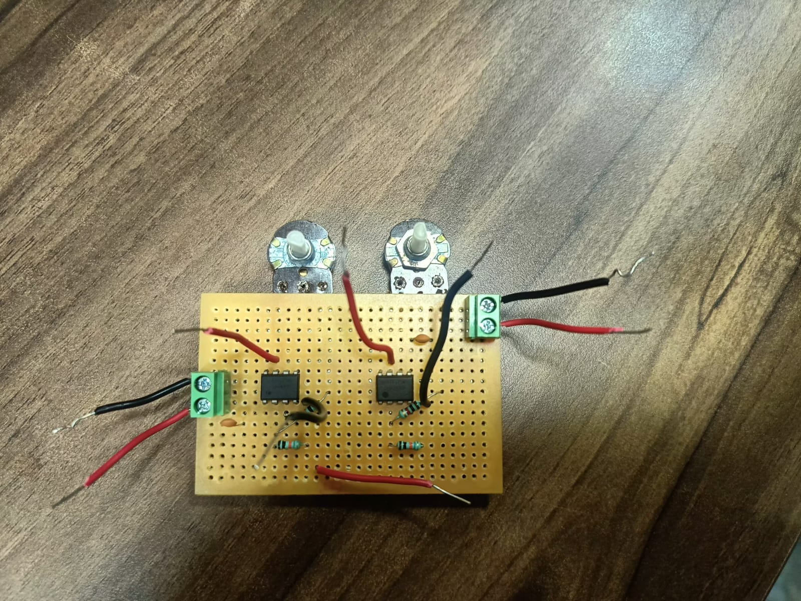
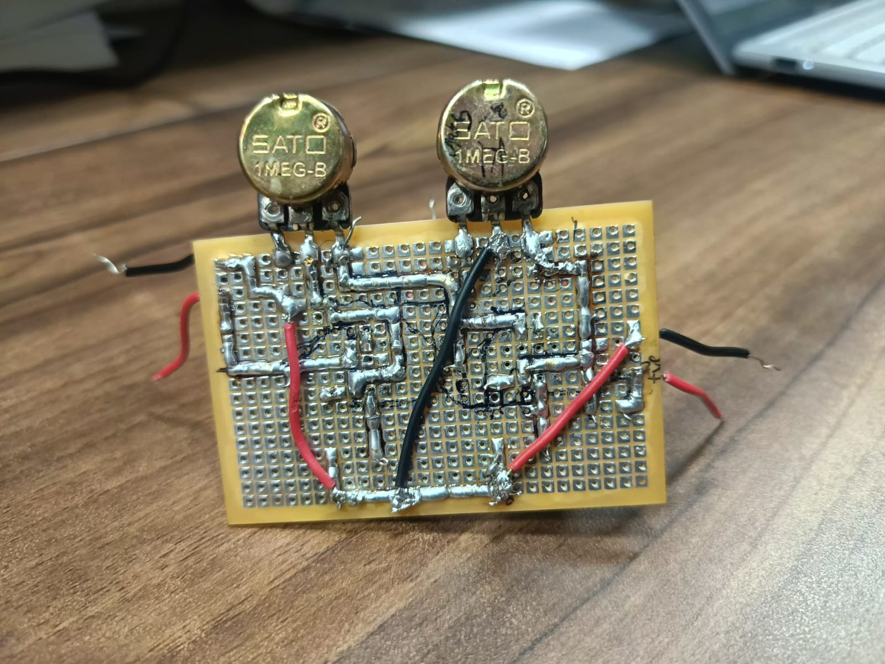
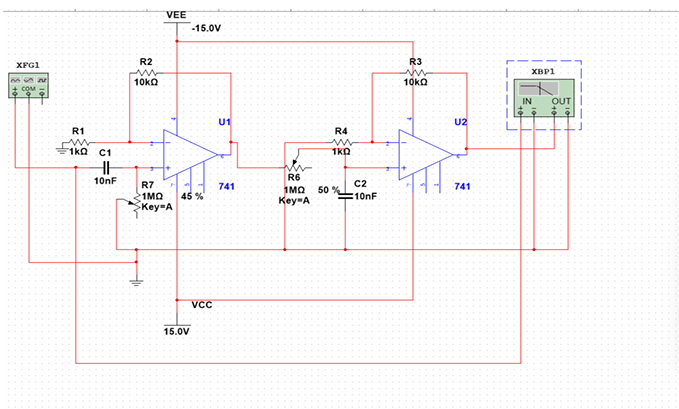
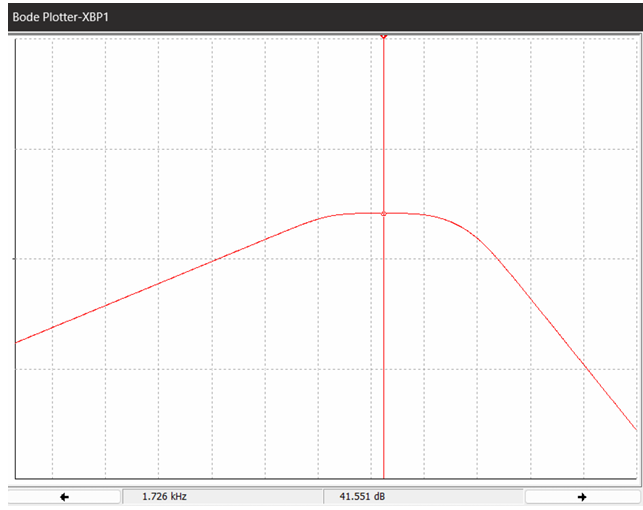

# Bandpass Filter using 741 Op-Amps

## 📌 Project Aim
To design and implement a Band-Pass Filter using two 741 operational amplifiers (op-amps).

## 🧪 Apparatus Required
- 2 × IC 741 Operational Amplifiers
- 2 × Potentiometers (1 MΩ each) To Get Band As Per Requirement of User.
- Resistors: 1 kΩ, 10 kΩ, 100 kΩ
- Capacitors: 1000 pF, 100 pF
- Function Generator
- Dual DC Power Supply (±15V)
- Breadboard or PCB and Connecting Wires

## 🧠 Theory
A band-pass filter allows signals within a specific frequency range to pass, while attenuating others. This design includes:
- A High-Pass Filter (HPF)
- A Low-Pass Filter (LPF)

Both use active op-amp configurations for better gain and control.

## 🧮 Calculations
- **HPF Cutoff (fa)**: ~159 Hz
- **LPF Cutoff (fb)**: ~16 kHz
- **Final Gain (dB)**: ~41.36 dB

## 💻 Simulation

We simulated the circuit using **NI Multisim**. You can open the file below using Multisim (version 13 or above):

- [bandpass_filter_simulation.ms14](bandpass_filter_simulation.ms14)

The simulation demonstrates the correct band-pass behavior of the designed circuit.

## 🔧 PCB Implementation
Here is the actual circuit implemented on a soldered PCB:

### Front View

### Back View

## 💻 Simulation (NI Multisim)

### Circuit Diagram

### Output Waveform

## 📄 Full Report
Check [Bandpass_Filter_Report.pdf](Bandpass_Filter_Report.pdf) for detailed documentation.
